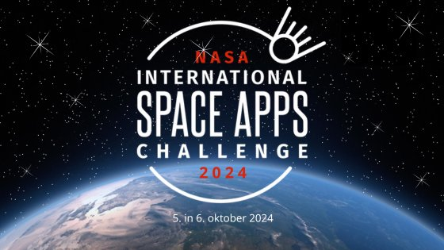

# NASA Space Apps Challenge 2024 - EXOPLANET EXPLORER




## Project Overview

This repository contains the code and resources for our project submission to the **NASA Space Apps Challenge 2024**. Our project, titled **EXOPLANET EXPLORER**, aims to teach about the fascinating world of exoplanets to children. We designed and developed a solution that aims to simplify the learning process.

Visit our final website: [Project Website](https://rahulkrishnakr.github.io/Nasa_Space_Apps/)

## Problem Statement

[Chronicles Of Exoplanet Exploration](https://www.spaceappschallenge.org/nasa-space-apps-2024/challenges/chronicles-of-exoplanet-exploration/)

## Solution

Our solution, **EXOPLANET EXPLORER**, leverages simple html,css & JavaScript to provide a simple but engaging interface platofrom for generating curiosity among learners. 

## Technology Stack
The project was developed using the following technologies:
- **Frontend:** [HTML, CSS, JavaScript, React, etc.]
- **Version Control:** [Git and GitHub for collaboration]

## Installation and Setup
To run this project locally, follow these steps:
1. Clone the repository:
   ```bash
   git clone https://github.com/RAHULKRISHNAKR/Nasa_Space_Apps.git
   ```
2. Navigate to the project directory:
   ```bash
   cd Nasa_Space_Apps
   ```
3. Install dependencies (if applicable):
   ```bash
   npm install
   ```
4. Run the project (specify how, e.g.,):
   ```bash
   npm start
   ```
5. Open your browser and navigate to `http://localhost:3000` (or any other relevant URL).

## Team

Our team is composed of talented individuals passionate about space and technology. We collaborated to bring this project to life over the 48-hour hackathon.

- **Rahul Krishna K R** (GitHub: [RAHULKRISHNAKR](https://github.com/RAHULKRISHNAKR)) 
- **SivaPriya K M** (Github: [sivapriya521](https://github.com/sivapriya521))
- **Soan** (Github: [trickle243](https://github.com/trickle243))


## Acknowledgements

- NASA Space Apps Challenge for the opportunity to participate in this incredible global event.
---
